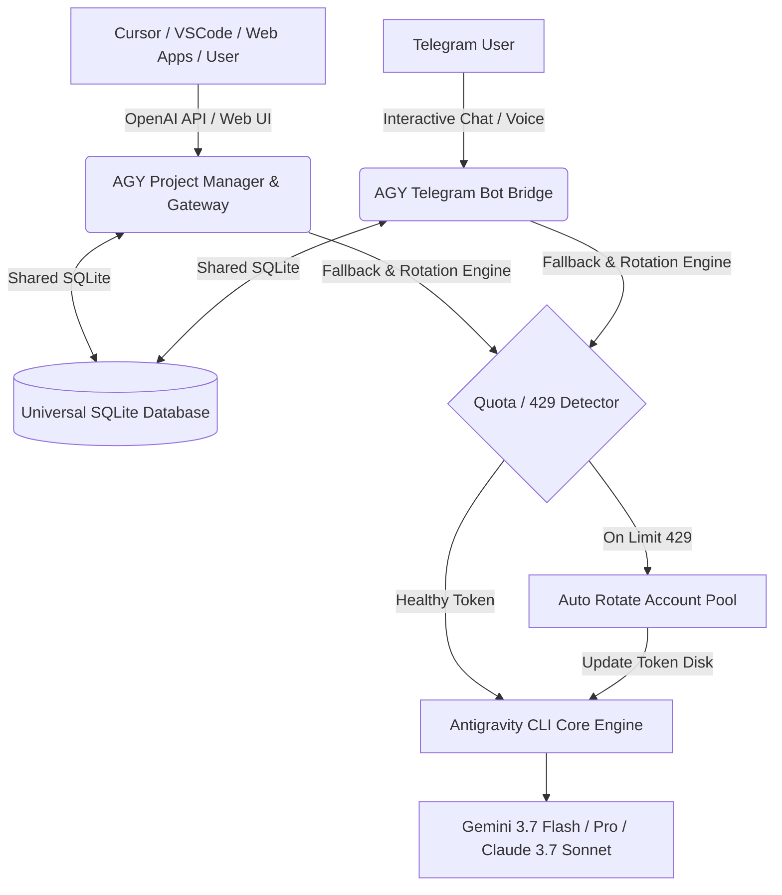

# 🚀 Antigravity Orchestrator Pro (AGY Integration Hub)
> **The Enterprise-Grade AI Agent Orchestration, Multi-Account Fallback & OpenAI-Compatible Gateway**

<div align="center">

[](https://github.com/PrimeFox59/agy-integration-hub)
[](https://github.com/PrimeFox59/agy-integration-hub)
[](https://github.com/PrimeFox59/agy-integration-hub)
[](LICENSE)

**Solusi otomatisasi AI Agent nir-henti tanpa terganggu oleh Rate Limit (429) & Token Quota Exceeded.**

[Fitur Unggulan](#-fitur-unggulan-siap-jual) • [Arsitektur](#-arsitektur-sistem) • [Instalasi Cepat](#-instalasi--menjalankan) • [OpenAI Gateway](#-openai-compatible-gateway-cursor--vscode--apps) • [Telegram Bot](#-telegram-bot-bridge) • [Lisensi](#-lisensi--komersial)

</div>

---

## 🌟 Mengapa Produk Ini Sangat Bernilai Tinggi?

Saat membangun software dengan bantuan AI Agent seperti **Antigravity CLI (Gemini 3.7 Flash/Pro, Claude 3.7 Sonnet)**, kendala utama yang sering menghentikan produktivitas adalah **Limit Token per Menit (TPM) & Kuota Harian Habis (Error 429)**.

**Antigravity Orchestrator Pro** mengatasi masalah tersebut secara total dengan sistem **Smart Multi-Account Auto-Fallback & Rotation Engine**. Ketika satu akun mencapai limit kuota, sistem secara instan mengalihkan tugas ke akun berikutnya dalam hitungan milidetik dan melanjutkan proses generate kode tanpa memutus percakapan!

---

## 🔥 Fitur Unggulan Siap Jual

```
┌──────────────────────────────────────────────────────────────────────────────────┐
│                        ANTIGRAVITY ORCHESTRATOR PRO                              │
├────────────────────────┬─────────────────────────┬───────────────────────────────┤
│ 🔄 Auto-Fallback Pool  │ 🔌 OpenAI API Gateway   │ 📱 Telegram Bot Pro Bridge    │
│ • Zero-downtime switch │ • /v1/chat/completions  │ • Interactive inline menus    │
│ • 429 & Quota detection│ • Plug into Cursor/VSCode│ • Voice & document analysis  │
│ • Auto-cooldown reset  │ • LibreChat / OpenWebUI │ • Realtime stream progress    │
├────────────────────────┼─────────────────────────┼───────────────────────────────┤
│ 🌐 Web Control Center  │ 📊 VPS / PC Diagnostics │ 🗄️ Multi-Workspace Manager   │
│ • 1-Click Google OAuth │ • Live CPU, RAM & Disk  │ • Task Kanban delegation      │
│ • Export/Import backup │ • PM2 service manager   │ • Prompt template library     │
│ • Latency diagnostics  │ • Socket.IO live sync   │ • Universal SQLite adapter    │
└────────────────────────┴─────────────────────────┴───────────────────────────────┘
```

---

## 📐 Arsitektur Sistem



---

## 🚀 Instalasi & Menjalankan

### 🖥️ 1. Windows (PC Lokal) - 1-Click Runner
Cukup klik ganda file berikut:
```cmd
start-local.bat
```
*(Atau jalankan `.\start-local.ps1` via PowerShell)*

Script akan otomatis:
1. Mendeteksi runtime **Node.js** dan **Python 3.10 - 3.13** di PC Anda.
2. Menginstal seluruh modul dependensi yang dibutuhkan.
3. Mengimpor token akun aktif ke dalam pool secara instan.
4. Membuka **Web Dashboard** di `http://localhost:5678` dan menjalankan **Telegram Bot**.

---

### 🐧 2. Linux / VPS Server - 1-Click Installer
Jalankan perintah ini di VPS Anda:
```bash
bash install.sh
```
*Otomatis menginstal Node.js, Python, PM2, dan menjalankan background services.*

---

### 🐳 3. Menggunakan Docker
```bash
docker-compose up -d
```

---

## 🔌 OpenAI-Compatible Gateway (Cursor / VSCode / Apps)

Hubungkan aplikasi AI coding favorit Anda ke **Antigravity Orchestrator Pro** untuk menikmati coding tanpa batas:

### Pengaturan di Cursor / Continue.dev / OpenWebUI:
* **Base URL:** `http://localhost:5678/v1`
* **API Key:** `sk-agy-xxxxxxxx` *(Dapatkan di menu Dashboard > API Gateway & Keys)*
* **Model:** `gemini-3.7-flash-low` | `gemini-3.7-flash-high` | `claude-sonnet-4-6`

#### Contoh Pemanggilan via Python (`openai` SDK):
```python
from openai import OpenAI

client = OpenAI(
    base_url="http://localhost:5678/v1",
    api_key="sk-agy-xxxxxxxx"
)

response = client.chat.completions.create(
    model="gemini-3.7-flash-low",
    messages=[{"role": "user", "content": "Buatkan sistem CRUD REST API modern dengan Express.js"}]
)

print(response.choices[0].message.content)
```

---

## 📱 Telegram Bot Bridge

* **Token Config:** Salin file `agy-telegram-bot/config.json.example` menjadi `config.json` dan masukkan token bot Anda.
* **Fitur Telegram:**
  * Kirim prompt teks langsung untuk dieksekusi CLI.
  * Tombol interaktif untuk mengganti model AI seketika.
  * Pantau status CPU/RAM dan kondisi pool akun secara real-time.
  * Voice message & document code analyzer.

---

## 🔐 Kredensial Default Web Dashboard

* **URL Dashboard:** `http://localhost:5678`
* **Username Default:** `admin`
* **Password Default:** `admin@prime2026!`

---

## 📄 Lisensi & Komersial

Project ini dilisensikan dengan **Commercial-Ready License**. Anda diizinkan untuk:
* Melakukan deployment pada server pribadi atau infrastruktur perusahaan.
* Melakukan *White-labeling* (mengganti nama, logo, tema) untuk solusi AI internal maupun proyek klien B2B.
* Menjadikan produk ini sebagai aset digital komersial.

Lihat [COMMERCIAL.md](COMMERCIAL.md) untuk panduan monetisasi dan analisis pasar.
